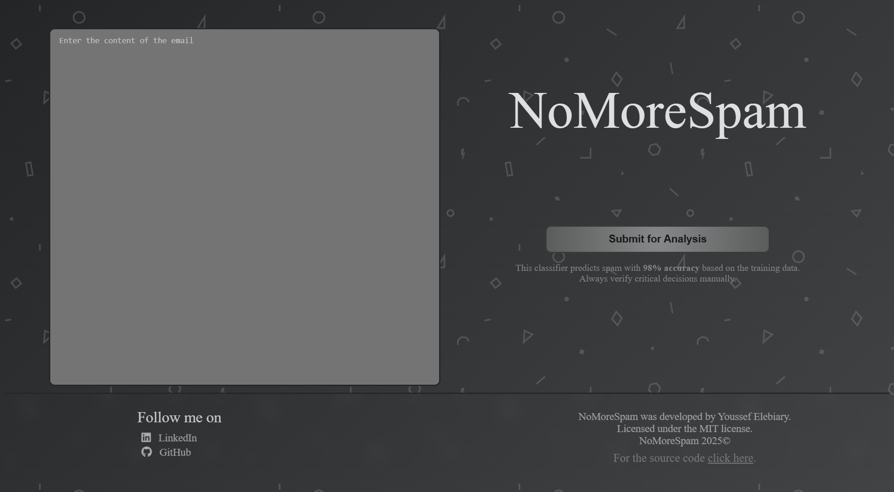

# NoMoreSpam
___

 


## Table of Contents
- [Description](#description)
- [Features](#features)
- [Installation](#installation)
- [Usage Instructions](#usage-instructions)
- [Technologies Used](#technologies-used)
- [Credits](#credits)
- [License](#license)

## Description
NoMoreSpam is a web application that uses a machine learning algorithm (SVM) to classify if an email is spam or ham. <br>
Users can input the text content of the email and the model will display its prediction with the percentage of the email being spam. <br>
For more details on the machine learning process, [click here](https://www.kaggle.com/code/youssefelebiary/nomorespam). <br>
To access the preprocessed version of the dataset [click here](https://www.kaggle.com/datasets/youssefelebiary/spam-emails-preprocessed).<br><br>

## Features
- **Spam Email Detection**: &nbsp;Predicts whether the given text is spam or ham.
- **Spam likelihood Percentage**: &nbsp;Displays the likelihood of the email being spam.
- **User Friendly Interface**: &nbsp;Simple and responsive web interface.
- **Automatic Preprocessing**: &nbsp;Automatic cleaning and preprocessing of the given text for accurate predictions. <br><br>

## Installation
Follow these steps to install and run the web app locally.
*Note: It is preferred to install and run the web app through a virutal enviroment to avoid conflicts*
1. Clone the repository
    ```bash
    git clone https://github.com/YoussefElebiary/NoMoreSpam
    ```
2. Navigate to the project directory
    ```bash
    cd NoMoreSpam
    ```
3. Install the required dependencies:
    ```bash
    pip install -r requirements.txt
    ```
4. Run the Flask app:
    ```bash
    flask run
    ```
5. Open your browser and visit `127.0.0.1:5000`
**Note**: If you want to access the app from another device, you can specify your device's IP address in the `app.run()` method, e.g., `app.run(host='192.0.0.10', port=8080)`.

## Usage Instructions
1. Copy and Paste the email in the text box.
2. Click submit and the prediction will appear clearly with the likelihood of it being spam.

## Technologies Used
- **Python**: &nbsp;Core programming language, used to train the machine learning model and develop the back-end of the web application.
- **Flask**: &nbsp;Web framework for building the application.
- **SVM**: &nbsp;The machine learning model for classification.
- **JavaScript**: &nbsp;Used to make the web app dynamic and handle the back-end requests.

## Credits
This web application was made by [**Youssef Elebiary**](https://github.com/YoussefElebiary/).
Connect with me on [LinkedIn](https://www.linkedin.com/in/youssef-elebiary/).

**Acknowledgments**:
- [NLTK](https://www.nltk.org/) used for text preprocessing.
- [Flask](https://flask.palletsprojects.com/) used for the web framework.

## License
This project is licensed under the MIT License. See the [LICENSE](LICENSE) file for details.